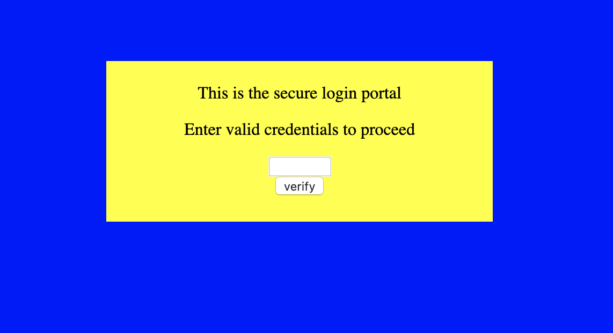

# dont-use-client-side
**Category:** web <br>
**Point:** 100

> Can you break into this super secure portal? https://2019shell1.picoctf.com/problem/21888/ (link) or http://2019shell1.picoctf.com:21888

---



Ini adalah challenge dengan kategori web exploitation. Kita diberikan sebuah link website yang berisi sebuah input _credential_ untuk  mendapatkan flagnya.

Pada source web, kita bisa lihat proses yang terjadi pada pengecekan _credential_-nya.

```javascript
function verify() {
  checkpass = document.getElementById("pass").value;
  split = 4;
  if (checkpass.substring(0, split) == 'pico') {
    if (checkpass.substring(split*6, split*7) == '6a8e') {
      if (checkpass.substring(split, split*2) == 'CTF{') {
        if (checkpass.substring(split*4, split*5) == 'ts_p') {
          if (checkpass.substring(split*3, split*4) == 'lien') {
            if (checkpass.substring(split*5, split*6) == 'lz_5') {
              if (checkpass.substring(split*2, split*3) == 'no_c') {
                if (checkpass.substring(split*7, split*8) == 'b}') {
                  alert("Password Verified")
                }
              }
            }
          }
        }
      }
    }
  }
  else {
    alert("Incorrect password");
  } 
}
```

Dapat dipahami bahwa pengecekan dilakukan melalui potongan-potongan string (substring) dengan range index tertentu.

Untuk menyelesaikannya kita perlu melakukan reverse dengan cara mengurutkan dan merangkai berdasarkan range index yang telah diberikan.

> jangan bingung dengan angka variabel `split`

Berikut penjelasan potongannya
| range index | string |
| --- | --- |
| 0 - 3   | `pico` |
| 4 - 7   | `CTF{` |
| 8 - 12  | `no_c` |
| 13 - 15 | `lien` |
| 16 - 19 | `ts_p` |
| 20 - 23 | `lz_5` |
| 24 - 27 | `6a8e` |
| 28 - 29 | `b}`   |

flag : `picoCTF{no_clients_plz_56a8eb}`