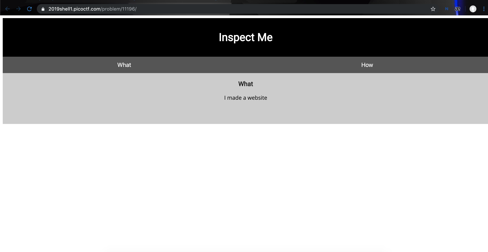

# Insp3ct0r
**Category:** web <br>
**Point:** 50

> Kishor Balan tipped us off that the following code may need inspection: https://2019shell1.picoctf.com/problem/11196/ (link) or http://2019shell1.picoctf.com:11196

---



Pada challenge ini kita diberikan sebuah sebuah link menuju sebuah website flat.

Untuk menyelesaikannya kita perlu melihat source web. Pada halaman `index` terdapat sebuah flag

```
<!-- Html is neat. Anyways have 1/3 of the flag: picoCTF{tru3_d3 -->
```

disitu terdapat clue bahwa terdapat 3 potongan flag yang ada. Selanjutnya kita inspeksi 1-1 file source yang ada dan didapatkan hasil seperti di bawah ini:

* index : `picoCTF{tru3_d3`
* mycss.css : `t3ct1ve_0r_ju5t`
* myjs.js : `_lucky?9df7e69a}`

flag : `picoCTF{t3ct1ve_0r_ju5t_lucky?9df7e69a}`