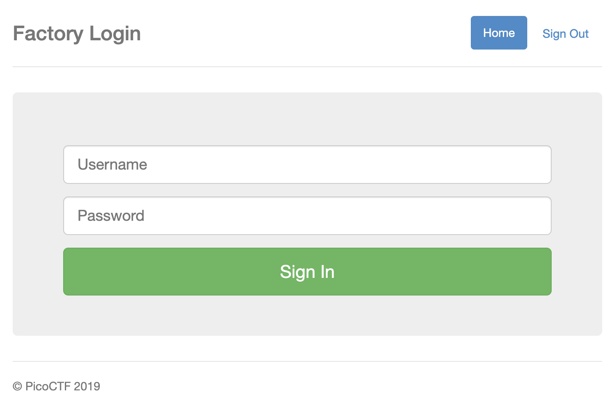
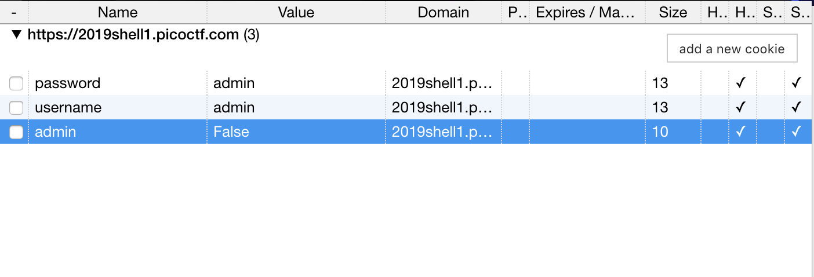
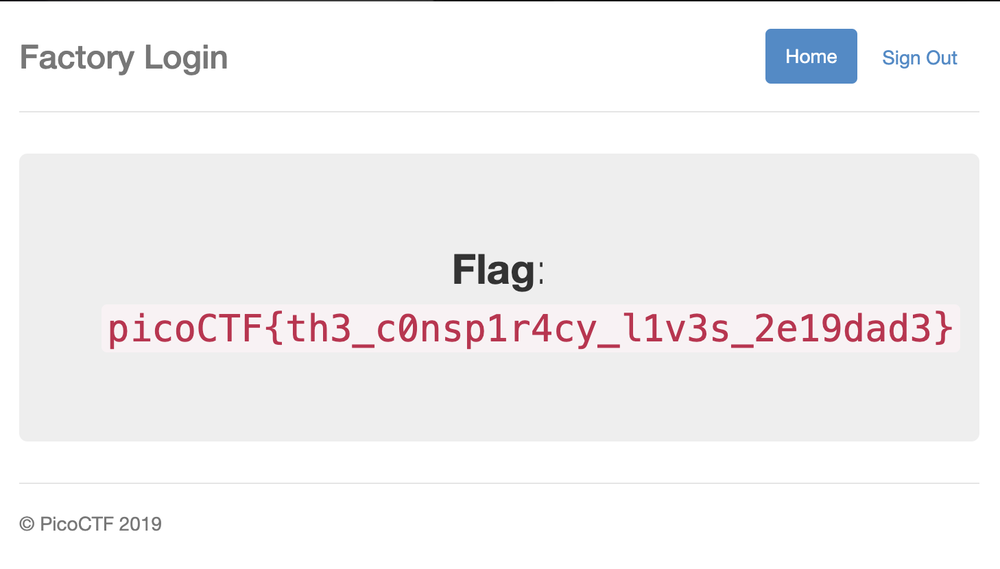

# logon
**Category:** web  
**Point:** 100

> The factory is hiding things from all of its users. Can you login as logon and find what they've been looking at? https://2019shell1.picoctf.com/problem/37907/ (link) or http://2019shell1.picoctf.com:37907

---

Pada challenge ini kita diberikan sebuah link menuju website login. Terdapat 2 buah input `username` dan `password`, apapun nilai yang dimasukkan dapat berhasil masuk ke halaman `/flag`.

Setelah diperhatikan, ternyata website ini menyimpan data cookies untuk login. Yang menarik adalah ada sebuah field bernama `admin` yang defaultnya  di-_set_ bernilai `False`.

Saya menggunakan extension Chrome bernama **Cookie Editor** untuk mengubah cookie. Selanjutnya, kita ubah nilai cookie `admin` menjadi `True` kemudian refresh halaman.

### exploit
* shell : [exploit.sh](./exploit.sh)
* python : [exploit.py](./exploit.py)

flag : `picoCTF{th3_c0nsp1r4cy_l1v3s_2e19dad3}`